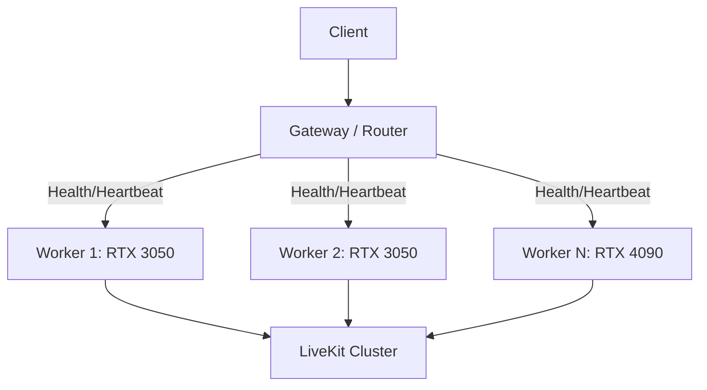

# Horizontal Scaling Architecture

## Worker Contract
Each worker strictly isolates `active_sessions`. A worker broadcasts its `max_capacity` (e.g., 1 for RTX 3050) and its current `active_sessions`. The gateway routes purely on this deterministic mathematical availability, never on ambiguous queue states.

## Backpressure
If no worker is `READY`, the Gateway returns an explicit HTTP 429/503 response. The system explicitly avoids infinite queuing.
