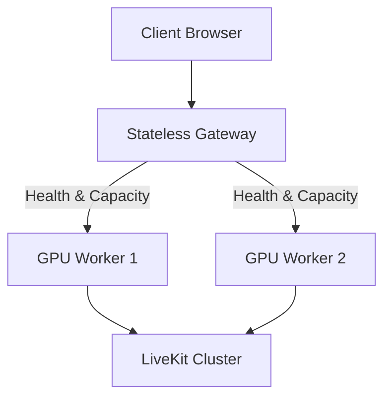

# Horizontal Scaling Architecture (Updated)

## Admission Contract
- `429 Too Many Requests`: Capacity/admission rejection (all workers full).
- `503 Service Unavailable`: Worker/service unhealthy (no workers available).

## Heartbeat Contract
Workers emit heartbeats every 5 seconds. Gateways enforce a 15-second timeout before transitioning a worker to `UNHEALTHY`.
