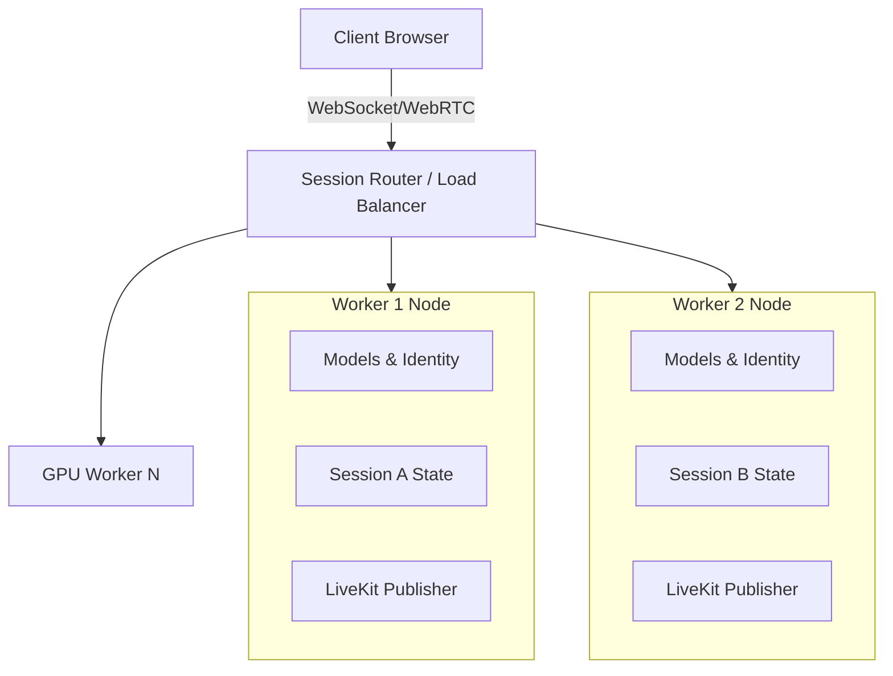

# Horizontal Scaling Architecture

## Lifecycle
1. `START`: Worker boots and loads models to GPU.
2. `READY`: Worker signals Router via healthcheck.
3. `ACCEPT SESSION`: Router assigns Turn/Session ID.
4. `RUN SESSION`: Active pipeline.
5. `CLEANUP`: ConvLSTM, Eye state, and LiveKit buffers are thoroughly flushed.
